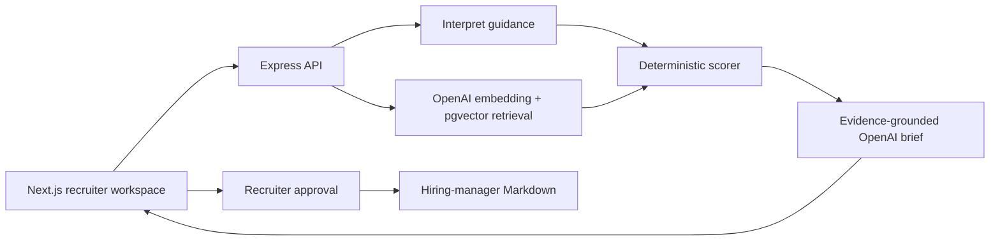

# TASC Recruiter Intelligence

A recruiter selects an open role, adds optional hiring priorities, and gets a ranked shortlist with evidence, gaps, and questions to ask. After reviewing the results, they can approve candidates and download a Markdown brief for the hiring manager.

- [Live application](https://tasc.up.railway.app)
- Loom walkthrough: add link after recording
- [Prompts](docs/PROMPTS.md) · [Example run](docs/EXAMPLE_INPUT_OUTPUT.md) · [Matching system](docs/MATCHING_SYSTEM.md)

## What the product does

1. Loads the 10 supplied roles and 120 candidate profiles.
2. Lets the recruiter add guidance such as “prioritize candidates available immediately” or “must be based in Dubai.”
3. Retrieves relevant profiles with pgvector, removes exact duplicates, and applies a deterministic scoring rubric.
4. Shows the score, supporting evidence, gaps, confidence, and three follow-up questions for each candidate.
5. Requires the recruiter to select candidates before producing a hiring-manager brief.

The tool recommends a review order. It does not make a hiring decision.

## Why the system is hybrid

I wanted the flexible parts to use AI without making the ranking opaque. OpenAI interprets recruiter language and writes concise, evidence-grounded explanations. Retrieval, eligibility, and scoring remain deterministic, so the same inputs produce the same ranking and every point can be inspected.

Candidate profile text is treated as untrusted data, not as model instructions. Missing information is described as “not evidenced” and lowers confidence rather than being invented.

## Architecture



- `web`: Next.js, React, and TypeScript.
- `server`: Node.js, Express, TypeScript, and TypeDI.
- Postgres: roles, normalized candidates, embeddings, match runs, and approvals.
- pgvector: cosine-similarity retrieval using 256-dimension OpenAI embeddings.
- OpenAI: the official JavaScript SDK, Responses API Structured Outputs, and embeddings API.

Services use constructor injection. `Container.get` is limited to composition roots such as application startup and database seeding.

## Matching in brief

With no recruiter guidance, the technical role-fit score is the final score:

| Component | Points |
| --- | ---: |
| Required skills | 40 |
| Semantic and role evidence | 30 |
| Experience alignment | 10 |
| Nice-to-have skills | 5 |
| Role location | 15 |

When guidance contains preferences, the final score becomes 70% technical role fit and 30% recruiter-priority alignment. Required criteria filter candidates before ranking. In this recruiter context, “should be in Dubai” is required, while “ideally should be in Dubai” remains preferred because explicit soft language takes precedence. The same contract supports availability, required or excluded evidence, numeric experience, and alternative or excluded locations.

Candidates must also meet a small relevance floor: at least half of the required skills and a technical role-fit score of 45. A known experience value below the role minimum is excluded from the primary shortlist. The upper bound remains a soft target, so one additional year receives only a small penalty rather than causing rejection. Unknown experience stays reviewable and is clearly marked for verification. Explicit required recruiter guidance can replace the default minimum for that run.

If this leaves fewer candidates than requested, the interface reports how many otherwise relevant profiles were excluded for falling below the minimum. It does not silently pad the shortlist with underqualified profiles.

The complete formulas, tie-breaking rules, confidence calculation, and examples are in [Matching system](docs/MATCHING_SYSTEM.md).

## Run locally

Requirements: Node.js 24+, npm, Docker Desktop, and an OpenAI API key.

```bash
npm install
npm run install:all
cp .env.example server/.env
cp .env.example web/.env.local
npm run db:up
npm run db:setup
npm run dev
```

Set `OPENAI_API_KEY` in `server/.env`. The API refuses to start without it. Open [http://localhost:3000](http://localhost:3000); the API runs on port `4000` and local pgvector on `54329`.

The main environment variables are:

| Variable | Purpose |
| --- | --- |
| `DATABASE_URL` | Postgres connection string |
| `OPENAI_API_KEY` | Required for embeddings, guidance, and explanations |
| `OPENAI_MODEL` | Structured-output model; defaults to `gpt-5.6-luna` |
| `OPENAI_EMBEDDING_MODEL` | Defaults to `text-embedding-3-small` |
| `WEB_ORIGIN` | Browser origin allowed by the API |
| `NEXT_PUBLIC_API_URL` | Browser-visible API URL |

Useful commands:

```bash
npm test                 # API unit tests
npm run build            # production builds for API and web
npm run db:down          # stop Postgres and keep its named volume
docker compose down -v   # remove the local database volume as well
```

## Deployment

The live version uses three Railway services: a pgvector-enabled Postgres database, the API built from `server/Dockerfile`, and the web application built from `web/Dockerfile`. The API migrates and idempotently seeds the supplied CSV data before starting.

`WEB_ORIGIN` must match the public web origin without a trailing slash. `NEXT_PUBLIC_API_URL` must be available while the Next.js image is built because it is embedded in the browser bundle.

## Assumptions and limits

- Skill matching uses normalized terms and a small, visible alias map.
- Missing experience, location, work history, or notice period lowers evidence confidence.
- Missing experience receives a neutral score and remains reviewable, but is shown as an evidence gap rather than confirmed alignment.
- Common notice-period formats are normalized; ambiguous values remain unknown.
- Exact content duplicates are hidden. Fuzzy duplicate detection is a sensible production follow-up.
- Protected characteristics are excluded from prompts and scoring.
- Authentication, recruiter audit logs, and a formal fairness review would be required before production use.

## How I would evaluate match quality at scale

I would start with a multi-rater judgment set: real role-candidate pairs labelled independently by recruiters and hiring managers across departments, seniority levels, locations, and data-quality conditions. Offline ranking metrics would include Precision@5 and NDCG@5, but I would also measure whether every claimed skill and gap is supported by the source profile.

Guidance needs its own contrast tests. Changing “prefer Dubai” to “must be in Dubai” should predictably change reranking into filtering, while unrelated candidates should remain stable. Fairness tests would remove or swap demographic proxies where lawful and compare results across relevant slices.

In a staged rollout, I would measure shortlist acceptance, time to first qualified shortlist, recruiter reorder and rejection reasons, edits to the generated brief, and hiring-manager acceptance. Recruiter corrections should feed an evaluation set and versioned rubric experiments, not unchecked online self-training.

## Submission notes

- [Prompt documentation](docs/PROMPTS.md)
- [Example input and output](docs/EXAMPLE_INPUT_OUTPUT.md)
- [Detailed matching logic](docs/MATCHING_SYSTEM.md)
- [Five-minute Loom outline](docs/LOOM_SCRIPT.md)

Current verification: 37 API tests pass, both production builds pass, and the core flow has been exercised in a real browser against Postgres, pgvector, and OpenAI.
