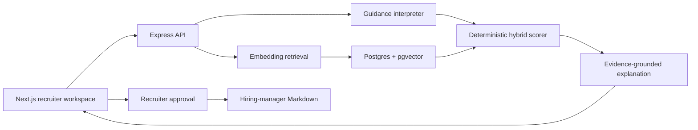

# TASC Match Intelligence

An evidence-first candidate matching workspace for in-house recruiters. A recruiter selects an open role, adds optional natural-language guidance, reviews a ranked and deduplicated shortlist, inspects the evidence behind each score, and approves candidates into a Markdown brief for the hiring manager.

The product intentionally separates retrieval, scoring, explanation, and approval. The score remains deterministic and inspectable. OpenAI is used where language understanding adds value: interpreting recruiter guidance and turning structured evidence into concise recruiter briefs.

## Product brief

Recruiters rarely need another resume search box. They need a defensible answer to four questions:

1. Who should I review first?
2. What evidence supports that recommendation?
3. What is missing or unreliable?
4. What should I ask next?

TASC Match Intelligence turns a role and optional recruiter guidance into a shortlist that answers those questions. It also keeps the recruiter in control: hard filters are applied only when guidance uses explicit constraint language, candidates must be selected before approval, and the final artifact is editable Markdown rather than an automated hiring decision.

### Key product choices

- Match score and evidence confidence are separate. A profile can look relevant but still have low confidence because its experience, location, or work history is incomplete.
- Candidate content is treated as untrusted evidence, never as instructions to the model.
- Missing skills are described as "not evidenced," not as proven absences.
- Duplicate profiles are hidden from the shortlist and reported in the run summary.
- The application remains fully usable without an API key through deterministic local embeddings and templated evidence explanations.

## Architecture



- `web`: Next.js and TypeScript frontend.
- `server`: Node.js, Express, TypeScript, and `@freshgum/typedi`.
- `data`: the supplied role and candidate CSVs.
- Postgres: source of truth for normalized profiles, match runs, scores, and approvals.
- pgvector: cosine-similarity retrieval over 256-dimension profile embeddings.
- OpenAI: official JavaScript SDK, Responses API Structured Outputs, and embeddings API.

Dependency injection is intentionally boring. Services declare constructor dependencies, while `Container.get` appears only at composition roots such as `createApp` and the seed script. Controllers do not reach into the container.

## Matching approach

The pipeline is hybrid rather than LLM-only:

1. Normalize obvious CSV inconsistencies without inventing missing facts.
2. Flag missing or suspicious evidence and fingerprint exact duplicate profiles.
3. Convert the role, recruiter guidance, and candidate profiles into embeddings.
4. Retrieve up to 120 candidates with pgvector cosine distance.
5. Apply deterministic, transparent scoring and explicit eligibility rules.
6. Generate evidence-grounded explanations and exactly three questions.
7. Persist the run and wait for recruiter approval.

### Default score rubric

| Component | Points | What it measures |
| --- | ---: | --- |
| Required skills | 35 | Direct or alias-based evidence for role requirements |
| Role evidence | 20 | Semantic similarity plus title/past-role evidence |
| Experience | 15 | Alignment with the role's stated experience range |
| Preferred skills | 10 | Evidence for nice-to-have requirements |
| Logistics | 10 | Role location and reported notice period |
| Recruiter guidance | 10 | Evidence for explicit recruiter priorities |

The experience and guidance weights can trade up to 10 points in either direction when the recruiter explicitly says experience matters more or less. Soft guidance changes ranking. Hard eligibility gates are created only by words such as "must," "only," "required," or "within."

This rubric is deliberately not a hiring decision. It is a review-order heuristic whose components are visible in the interface.

## Local setup

Requirements: Node.js 24+, npm, and Docker Desktop.

```bash
npm install
npm run install:all
cp .env.example server/.env
cp .env.example web/.env.local
npm run db:up
npm run db:setup
npm run dev
```

Open [http://localhost:3000](http://localhost:3000). The API runs on [http://localhost:4000](http://localhost:4000), and pgvector is exposed locally on port `54329`.

`OPENAI_API_KEY` is optional. Add it to `server/.env` to enable OpenAI embeddings, guidance interpretation, and explanation generation. Without it, all flows use the deterministic local fallback. Next.js reads `NEXT_PUBLIC_API_URL` from `web/.env.local`.

Useful commands:

```bash
npm test                 # unit tests
npm run build            # production builds for API and web
npm run db:down          # stop local Postgres, preserving its named volume
docker compose down -v   # optional full local database reset
```

## Environment variables

| Variable | Default | Purpose |
| --- | --- | --- |
| `DATABASE_URL` | local Docker URL | Postgres connection string |
| `PORT` | `4000` | API port |
| `WEB_ORIGIN` | `http://localhost:3000` | Allowed browser origin |
| `NEXT_PUBLIC_API_URL` | `http://localhost:4000` | Browser-visible API URL |
| `OPENAI_API_KEY` | empty | Enables OpenAI mode |
| `OPENAI_MODEL` | `gpt-5.6-luna` | Structured guidance and explanation model |
| `OPENAI_EMBEDDING_MODEL` | `text-embedding-3-small` | Candidate and role embedding model |
| `DATA_DIR` | `../data` from server | Optional CSV directory override |

## Railway deployment

Create one Railway project with three services:

1. **Postgres**: deploy Railway's [pgvector template](https://railway.com/deploy/pgvector-latest) rather than the standard Postgres service, which does not bundle the extension. Expose the pgvector service's private `DATABASE_URL` to the API service. The API migration runs `CREATE EXTENSION IF NOT EXISTS vector`.
2. **API**: deploy this repository using `server/Dockerfile`. Set `DATABASE_URL`, `WEB_ORIGIN`, and optionally `OPENAI_API_KEY`. The container migrates and idempotently seeds before starting.
3. **Web**: deploy this repository using `web/Dockerfile`. Set the build argument and environment variable `NEXT_PUBLIC_API_URL` to the public API URL.

The API Dockerfile expects the repository root as its build context because it copies the supplied CSV files from `data/`.

## Assumptions and edge cases

- Skills are comma-separated and matched using normalized terms plus a small, visible alias map.
- Missing years, location, work history, or notice period reduce evidence confidence.
- Negative experience is treated as invalid. Written experience such as "five years" is parsed.
- Common notice variants such as immediate, days, weeks, and months are normalized. "Negotiable" stays unknown.
- Suspicious education date ranges are surfaced as a low-severity note and are not repaired.
- Exact normalized duplicates are deduplicated by content fingerprint. Fuzzy duplicate detection would be a production follow-up.
- Protected characteristics are excluded from prompts and scoring. A production system would add formal fairness review and jurisdiction-specific compliance controls.

## Prompts and example run

- [Prompts](docs/PROMPTS.md)
- [Example input and output](docs/EXAMPLE_INPUT_OUTPUT.md)
- [Suggested 3-6 minute Loom script](docs/LOOM_SCRIPT.md)

## Evaluating match quality at scale

Matching is subjective, so I would use a layered evaluation program rather than a single accuracy number.

### 1. Build a judgment set

Sample real role-candidate pairs across functions, seniority, geography, and data quality. Ask at least two recruiters plus the hiring manager to independently label relevance and state why. Adjudicate disagreements, but retain them as a measure of task ambiguity.

### 2. Measure ranking and evidence quality offline

- `Precision@5` and `NDCG@5` against recruiter judgments.
- Recall of candidates who reached screen, interview, or offer stages.
- Required-skill evidence precision: when the product says a skill matched, can a reviewer point to supporting text?
- Gap and question usefulness, rated blindly by recruiters.
- Calibration by score band and evidence-confidence band.
- Slice results by role family, seniority, country, source, and missing-data pattern.

### 3. Evaluate guidance following

Create contrast sets where one phrase changes, such as "prefer immediate availability" versus "must start within 30 days." Verify that soft guidance reranks while hard guidance filters, and that unrelated candidates do not move unexpectedly.

### 4. Run counterfactual fairness and safety tests

Remove or swap names and other demographic proxies where lawful, then test whether rankings remain stable. Review disparate selection rates by relevant protected groups with legal and HR partners. Red-team prompt injection embedded in candidate content and unsupported model claims.

### 5. Measure recruiter outcomes online

Run a staged A/B test against the existing workflow. Primary measures would be shortlist acceptance rate, time to first qualified shortlist, recruiter edits to the generated brief, and hiring-manager acceptance. Downstream measures such as interview-to-offer conversion are useful but heavily confounded, so they should be interpreted with care.

### 6. Close the feedback loop

Capture structured reasons when recruiters reorder, reject, or approve candidates. Use that feedback for rubric tuning and retrieval evaluation, not direct online self-training. Version the rubric and prompts, run regression suites before release, and monitor drift as roles and candidate sources change.

The success criterion is not "the AI picked the hire." It is that recruiters find qualified people faster, can verify every claim, and retain meaningful control over the decision.

## Tests completed

- Normalization and data-quality unit tests.
- Recruiter-guidance interpretation unit tests.
- Hybrid scoring and eligibility unit tests.
- TypeScript production builds for API and frontend.
- Live Postgres 17 plus pgvector 0.8.1 migration and seed.
- API checks for health, metadata, role retrieval, matching, approval, and Markdown output.
- Browser walkthrough on desktop and mobile viewports.
